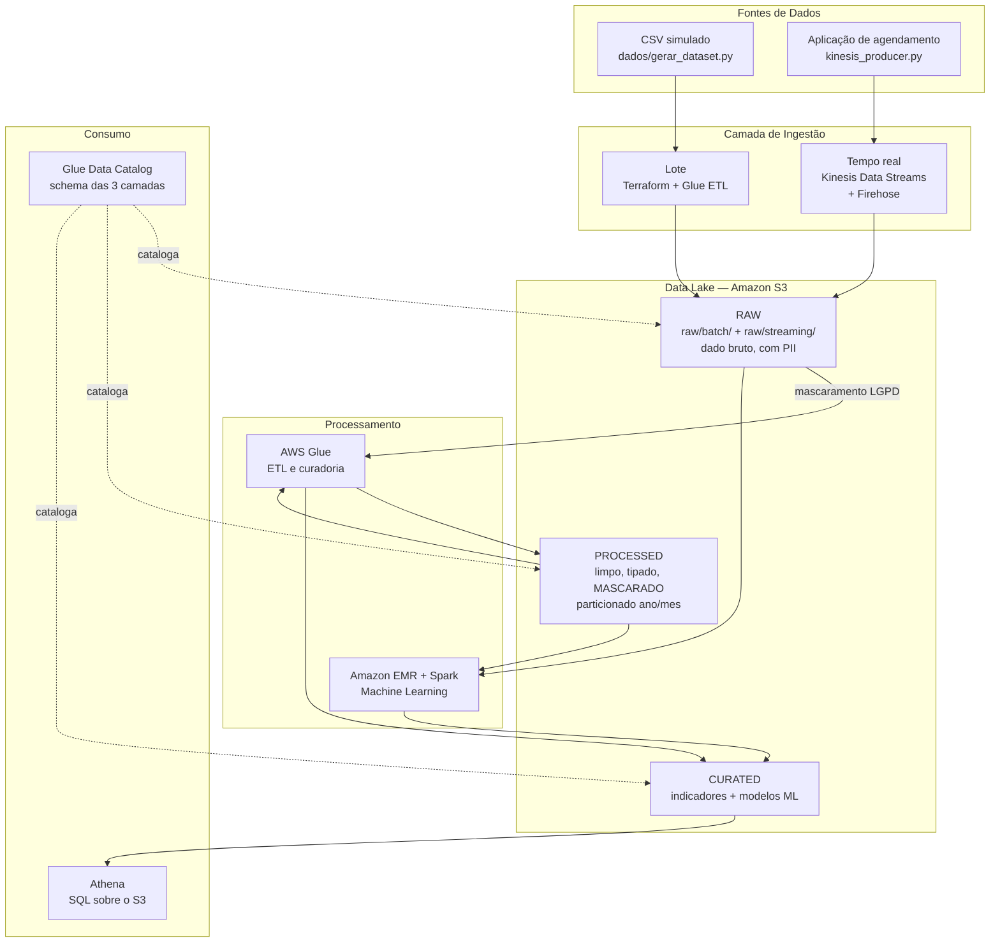
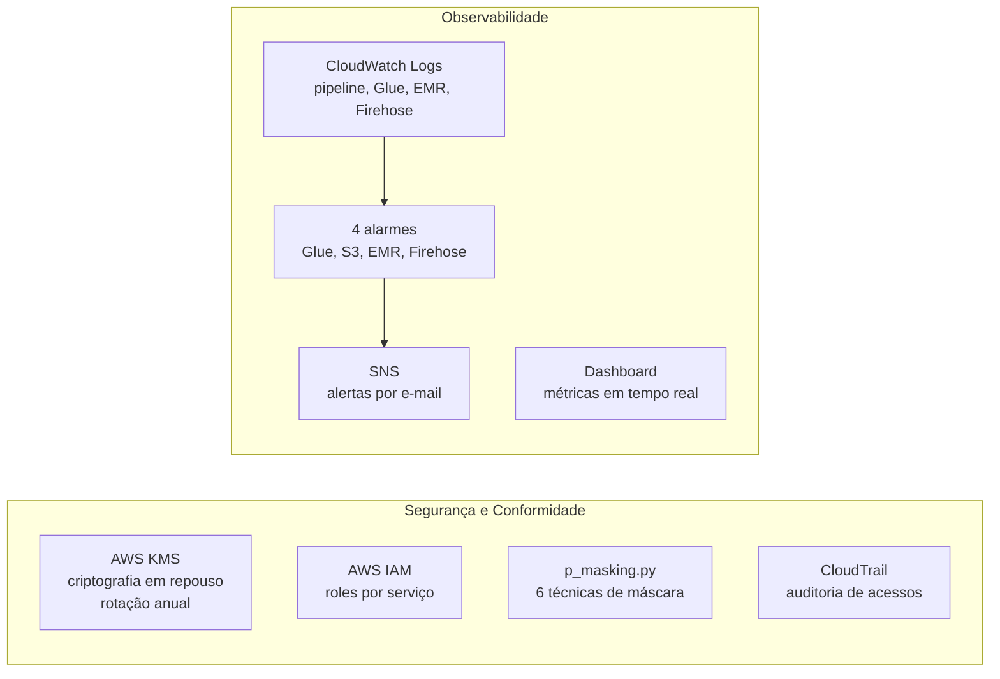

# 🚀 Projeto DM — Solução de Engenharia de Dados na AWS


---

## I. Objetivo do Case

Este projeto foi desenvolvido como resposta ao desafio da **Academia Santander de Engenharia de Dados**, com o objetivo de projetar e implementar uma **solução completa de Engenharia de Dados** capaz de lidar com grande volume de dados, abrangendo extração, ingestão, armazenamento, observabilidade, segurança, mascaramento, arquitetura de dados e escalabilidade.

### 1.1 Domínio escolhido: faltas em consultas do SUS

O tema dos dados é de livre escolha no case. Optamos por **saúde pública — prever quais pacientes faltam às consultas agendadas** por três razões:

1. **É um problema real e mensurável.** Quando o paciente falta, a vaga se perde e a fila não anda. Antecipar quem provavelmente vai faltar permite confirmar por telefone antes e remarcar a vaga.
2. **Tem dados pessoais legítimos a proteger.** Nome, CPF, e-mail e telefone de pacientes são dado pessoal sob a LGPD, e dão sentido concreto aos requisitos de segurança e mascaramento — em vez de tratá-los como capacidade teórica.
3. **Produz um alvo de classificação binária bem definido**, adequado ao treinamento distribuído com PySpark.

### 1.2 Origem dos dados

O case permite explicitamente o uso de **dados simulados**, e é o que fazemos: o dataset é produzido por `IaC/terraform/dados/gerar_dataset.py`.

A decisão é deliberada e tem três motivos técnicos:

- **Nenhum dado pessoal real trafega pelo pipeline**, nem mesmo em desenvolvimento. Privacidade por concepção, não por controle de acesso.
- **O volume é parametrizável.** A mesma stack roda com 90 mil ou 90 milhões de registros (`--linhas`), o que permite demonstrar escalabilidade de verdade em vez de afirmá-la.
- **O repositório permanece leve.** O CSV não é versionado (está no `.gitignore`); o que se versiona é a regra que o gera, com semente fixa e portanto reproduzível.

O gerador não produz ruído aleatório: a probabilidade de comparecimento depende de dias de espera, histórico de faltas, distância até a unidade, tipo de consulta e faixa etária. Existe sinal real para o modelo aprender.

Os coeficientes foram calibrados para uma **taxa de faltas em torno de 23%**, dentro da faixa observada na literatura sobre consultas ambulatoriais da rede pública. Um dataset com metade das consultas em falta seria trivial de modelar e implausível para quem conhece o domínio.

---

## II. Arquitetura de Solução e Arquitetura Técnica

### 2.1 Visão Geral

A solução segue uma **arquitetura Lambda**: duas vias de ingestão — lote e tempo real — que **convergem na camada RAW** e, daí em diante, percorrem exatamente o mesmo caminho de tratamento. Isso evita a armadilha clássica da arquitetura Lambda, que é manter duas lógicas de transformação divergentes.



**O ponto de controle da privacidade é único e explícito:** o mascaramento acontece na transição RAW → PROCESSED, antes de qualquer gravação. Dado pessoal em claro existe apenas na camada RAW, que é criptografada, sem acesso público, auditada pelo CloudTrail e expira por lifecycle rule.

### 2.2 Camadas de Segurança e Observabilidade



### 2.3 Componentes e Justificativas

| Componente | Tecnologia | Justificativa |
|---|---|---|
| IaC | Terraform 1.10+ | Reprodutibilidade, versionamento e bloqueio de estado nativo no S3 |
| Containerização | Docker 20.x+ | Ambiente isolado, portável, independente de SO |
| Armazenamento | Amazon S3 | Escalabilidade ilimitada, integração nativa com analytics AWS |
| Ingestão em tempo real | Kinesis Data Streams + Firehose | Buffer durável e reproduzível, entrega gerenciada sem servidores |
| ETL Batch | AWS Glue + PySpark | Serverless, integrado ao S3 e Athena, sem gestão de servidores |
| Processamento ML | Amazon EMR + Spark | Processamento distribuído com Managed Scaling |
| Catálogo de Dados | AWS Glue Data Catalog | Descoberta automática de schema, integrado ao Athena |
| Criptografia | AWS KMS | Rotação automática de chaves, conformidade com LGPD |
| Controle de Acesso | AWS IAM | Uma role por serviço, com permissões próprias |
| Monitoramento | AWS CloudWatch | Logs, métricas, alarmes e dashboard centralizados |
| Auditoria | AWS CloudTrail | Rastreamento de acessos a dado pessoal — exigido pela LGPD |
| Alertas | AWS SNS | Notificações por e-mail em caso de falha no pipeline |

### 2.4 Estrutura do Repositório

```
Projeto_DM/
├── .gitignore                          # Exclui tfstate, credenciais, dataset e logs
├── Dockerfile                          # Ambiente com Terraform, AWS CLI e Python
├── requirements.txt                    # Dependências Python dos scripts auxiliares
├── README.md                           # Este documento
│
└── IaC/terraform/
    ├── config.tf                       # Backend S3 + provider AWS
    ├── main.tf                         # Orquestra todos os módulos
    ├── variables.tf                    # Declaração de variáveis
    ├── terraform.tfvars.example        # Modelo de variáveis (copie para .tfvars)
    │
    ├── modules/
    │   ├── iam/                        # Roles do EMR, Glue e Firehose
    │   ├── kms/                        # Criptografia do Data Lake
    │   ├── s3/                         # Data Lake: RAW / PROCESSED / CURATED
    │   ├── kinesis/                    # Ingestão em tempo real (Streams + Firehose)
    │   ├── emr/                        # Cluster Spark com Managed Scaling
    │   ├── glue/                       # ETL + Data Catalog + Workflow
    │   └── monitoring/                 # CloudWatch + CloudTrail + SNS
    │
    ├── pipeline/                       # Scripts Python enviados ao S3
    │   ├── projeto.py                  # Orquestrador do job EMR
    │   ├── p_processamento.py          # RAW -> PROCESSED + engenharia de atributos
    │   ├── p_masking.py                # Mascaramento de dados sensíveis (LGPD)
    │   ├── p_ml.py                     # Treinamento e avaliação dos modelos
    │   ├── p_log.py                    # Sistema de logs
    │   ├── glue_job_etl.py             # Job Glue: RAW -> PROCESSED
    │   ├── glue_job_curated.py         # Job Glue: PROCESSED -> CURATED
    │   └── kinesis_producer.py         # Produtor de eventos em tempo real
    │
    ├── scripts/
    │   └── bootstrap.sh                # Prepara o ambiente Python nos nós EMR
    │
    └── dados/
        └── gerar_dataset.py            # Gerador do dataset simulado
```

---

## III. Explicação sobre o Case Desenvolvido

### 3.1 Extração de Dados

O dataset de atendimentos é gerado por `dados/gerar_dataset.py` com semente fixa (reproduzível) e volume parametrizável. Cada registro traz 19 colunas: identificação do atendimento, dados pessoais do paciente, localização, características da consulta, histórico do paciente e o alvo `compareceu`.

O contrato de dados é o mesmo nas duas vias de ingestão — `kinesis_producer.py` reaproveita as regras do gerador em lote — de modo que lote e streaming produzem registros indistinguíveis na camada RAW.

Para estender a outras fontes (APIs públicas, bancos de dados), basta acrescentar um script na pasta `pipeline/` que grave em `raw/`; nada abaixo da camada RAW precisa mudar.

### 3.2 Ingestão de Dados

**Lote.** O Terraform envia o CSV para `raw/batch/`. O job `projeto-dm-etl-job` do Glue roda diariamente às 03:00 UTC, orquestrado pelo Glue Workflow. O Amazon EMR executa o pipeline completo, incluindo o treinamento dos modelos.

**Tempo real.** O `kinesis_producer.py` publica eventos no **Kinesis Data Streams** (modo sob demanda, criptografado com KMS, 24h de retenção para reprocessamento). O **Kinesis Data Firehose** consome o stream e entrega em `raw/streaming/ano=/mes=/`, comprimido em GZIP, com buffer de 5 MB ou 60 segundos — o que ocorrer primeiro.

As duas vias gravam na mesma camada RAW em prefixos distintos, e daí em diante compartilham o mesmo tratamento.

Essa convergência é literal, não apenas conceitual: a transformação RAW → PROCESSED tem **uma única implementação**, em `p_processamento.py`, importada tanto pelo job do Glue quanto pelo pipeline do EMR. Como os dois gravam no mesmo prefixo da camada PROCESSED, uma segunda implementação abriria espaço para schemas divergentes na mesma tabela do Data Catalog — uma coluna tipada de um lado e não do outro basta para quebrar as consultas no Athena.

### 3.3 Armazenamento de Dados

O Data Lake é organizado em três camadas no **Amazon S3**, seguindo o padrão Medalhão:

| Camada | Prefixo S3 | Conteúdo |
|---|---|---|
| Bronze / RAW | `raw/batch/`, `raw/streaming/` | Dados brutos com PII, preservados integralmente |
| Silver / PROCESSED | `processed/atendimentos/` | Dados limpos, tipados e **mascarados**, particionados por ano/mes |
| Gold / CURATED | `curated/analytics/`, `curated/models/`, `curated/metrics/` | Indicadores, modelos treinados e métricas |

Criptografia SSE-KMS em repouso e bloqueio total de acesso público em todos os buckets. Lifecycle rules movem a camada RAW para Glacier após 90 dias e a expiram em 365 — a retenção limitada de dado pessoal é uma exigência da LGPD, aqui implementada como infraestrutura.

**Por que S3 e não um data warehouse?** O volume é alto, o formato é variado (CSV em lote, JSON em streaming) e o consumo é analítico e esparso. Um Redshift exigiria provisionamento constante para uso intermitente; o S3 com Athena cobra por varredura. Se o padrão de consumo virasse BI interativo e recorrente, a camada CURATED seria o ponto natural para materializar um warehouse.

### 3.4 Observabilidade

**Logs.** Grupos CloudWatch dedicados para pipeline, Glue, EMR e Firehose, com retenção de 30 dias.

**Alarmes.** Quatro alarmes automáticos, todos notificando por e-mail via SNS:

| Alarme | Condição |
|---|---|
| `glue-job-failure` | Qualquer tarefa do job ETL falha |
| `s3-no-new-data` | Nenhuma gravação na camada RAW por mais de 24h |
| `emr-cluster-failure` | Nós core pendentes por tempo excessivo |
| `firehose-atraso-entrega` | Evento mais antigo do buffer com mais de 15 minutos |

Dois detalhes valem menção, porque são erros fáceis de cometer e difíceis de perceber:

- O alarme de ingestão mede `PutRequests` sobre um filtro de métricas de requisição no prefixo `raw/`, e não `NumberOfObjects`. A segunda é uma métrica **diária de armazenamento** — diz quantos objetos existem, não quantos chegaram — e, como o bucket nunca fica vazio, jamais detectaria uma parada de ingestão.
- O alarme do EMR usa o **ID** do cluster (`j-XXXXXXXX`) na dimensão `JobFlowId`, não o nome. Com o nome, o alarme fica permanentemente em `INSUFFICIENT_DATA` e nunca dispara — um monitor que existe no console e não monitora nada.

**Dashboard.** O `projeto-dm-pipeline-dashboard` centraliza falhas do Glue, volume no S3, ingestão em tempo real (Kinesis e Firehose) e estado do cluster EMR.

**Auditoria.** O CloudTrail registra leituras e escritas no bucket principal — rastreabilidade de acesso a dado pessoal, exigida pela LGPD.

### 3.5 Segurança de Dados e LGPD

**Criptografia.** Chave KMS própria, com rotação automática anual, aplicada ao Data Lake e ao stream do Kinesis. Dados em trânsito protegidos por TLS.

**Controle de acesso.** Roles IAM separadas para EMR (serviço e EC2), Glue e Firehose, cada uma com policy própria:

- A role das instâncias EC2 do EMR — a que o Spark efetivamente assume — usa policy customizada restrita ao bucket do projeto, no lugar da `AmazonElasticMapReduceforEC2Role`, que concede acesso amplo a S3, DynamoDB, Glue e Kinesis em toda a conta.
- A role do Firehose escreve apenas em `raw/*` e lê apenas do stream do projeto.
- A policy da chave KMS autoriza nominalmente cada uma dessas roles. Sem isso o Spark falharia ao ler o bucket criptografado — e o erro só apareceria em execução.

**Superfície de rede.** O security group do nó principal do EMR não abre porta alguma por padrão. O acesso SSH depende de informar `allowed_ssh_cidr` em `terraform.tfvars`, e uma `validation` no Terraform **recusa explicitamente** `0.0.0.0/0`.

**Auditoria protegida.** O bucket do CloudTrail tem bloqueio de acesso público, criptografia em repouso, versionamento e retenção de 365 dias. Log de auditoria exposto é, por si só, um incidente: ele revela quem acessou qual dado pessoal e quando.

**Conformidade LGPD.** Retenção por lifecycle rules, auditoria via CloudTrail, mascaramento obrigatório antes da camada PROCESSED e, na origem, dados sintéticos.

### 3.6 Mascaramento de Dados

O `p_masking.py` implementa seis técnicas via UDFs Spark:

| Tipo de dado | Técnica | Exemplo |
|---|---|---|
| CPF | Tokenização parcial | `123.456.789-00` → `***.***.789-**` |
| CNPJ | Supressão total | `12.345.678/0001-90` → `**.***.***/****-**` |
| Nome | Pseudonimização (SHA-256) | `João Silva` → `ID_a3f1b2c4` |
| E-mail | Hash SHA-256 completo | `joao@email.com` → `a3f1b2c4...` |
| Telefone | Mascaramento parcial | `(11) 99999-9999` → `(11) ****-9999` |
| Valor financeiro | Substituição por faixa | `1500.00` → `1001-2000` |

As técnicas foram escolhidas para **preservar utilidade analítica**:

- O hash do nome é determinístico, então o mesmo paciente continua identificável entre execuções — é possível contar atendimentos por pessoa sem saber quem ela é.
- O DDD do telefone sobrevive, permitindo análise geográfica.
- O valor vira faixa e entra no modelo como atributo **categórico**, mantendo poder preditivo sem expor o valor exato.

O mapa `COLUNAS_SENSIVEIS`, em `p_processamento.py`, declara qual técnica se aplica a cada coluna. Colunas ausentes são ignoradas com registro em log, de modo que o mesmo mapa atende qualquer fonte nova ingerida na RAW.

### 3.7 Arquitetura de Dados

O **Glue Data Catalog** cataloga o schema das três camadas por meio de crawlers agendados (RAW às 02:00, PROCESSED às 04:00, CURATED às 06:00 UTC). O **Athena** consulta os dados diretamente no S3, sem movimentação.

O Glue Workflow encadeia os jobs: ETL às 03:00 UTC → curadoria, disparada por condição após o ETL concluir com sucesso.

**Particionamento.** As camadas PROCESSED e CURATED são particionadas por `ano/mes`, derivados da data do atendimento. A escolha de mês, e não de dia, é deliberada: com a volumetria atual, o particionamento diário produziria centenas de arquivos pequenos e degradaria a leitura — o clássico problema de *small files*. Com volume dez vezes maior, a partição diária passa a compensar, e a mudança é de uma linha.

### 3.8 Reprodutibilidade da arquitetura

O ambiente completo é reconstruído em qualquer máquina a partir do repositório, sem passo manual fora do que está documentado:

| O que | Onde está versionado |
|---|---|
| Ambiente de trabalho (Terraform, AWS CLI, Python) | `Dockerfile`, com imagem base e versões fixadas |
| Dependências Python dos scripts auxiliares | `requirements.txt`, instalado no build da imagem |
| Toda a infraestrutura AWS | `IaC/terraform/`, 7 módulos |
| Modelo de configuração | `terraform.tfvars.example` |
| Preparação dos nós do cluster | `scripts/bootstrap.sh` |
| Geração dos dados | `dados/gerar_dataset.py`, com semente fixa |
| Scripts de execução do pipeline | `pipeline/` |
| Instruções de execução | Seção **Como Executar** abaixo |

O que **não** é versionado, por decisão: `terraform.tfvars` (contém o Account ID e o e-mail de alertas), o `tfstate` e o `dataset.csv` — este último é reproduzido pelo gerador, com semente fixa, em vez de carregado no Git.

### 3.9 Escalabilidade

**Horizontal.** O EMR Managed Scaling adiciona e remove nós automaticamente conforme a demanda do YARN, entre 3 e 10 instâncias por padrão. O Kinesis em modo sob demanda ajusta os shards sozinho. O Glue escala workers por DPUs. O S3 é ilimitado por natureza.

**Vertical.** Tipos de instância e capacidade do cluster são variáveis em `terraform.tfvars` — `emr_master_instance_type`, `emr_core_instance_type`, `emr_core_instance_count`, `emr_max_capacity_units`. Escalar o ambiente não exige tocar em código.

**No dado.** Parquet colunar com compressão e particionamento por ano/mês reduz drasticamente o volume varrido pelo Athena. O pipeline não traz dados para o driver em nenhum ponto — toda a computação permanece distribuída.

### 3.10 Resultados Obtidos

Execução de referência sobre uma amostra de 20 mil registros (divisão 70/30, validação cruzada de 3 folds):

| Modelo | Acurácia | F1 | AUC |
|---|---|---|---|
| Linha de base (classe majoritária) | 0,765 | — | 0,500 |
| Regressão Logística | 0,761 | 0,681 | **0,679** |
| Random Forest | 0,765 | 0,663 | 0,666 |

**A leitura honesta destes números é a parte mais importante.** Como 76,5% das consultas têm comparecimento, um "modelo" que sempre responde *compareceu* já acerta 76,5% das vezes. Ou seja: **a acurácia dos dois modelos não supera a linha de base** — e é exatamente por isso que a linha de base está na tabela, e não escondida.

O que os modelos entregam de fato é **capacidade de ordenação**: AUC de 0,68 significa que, ao sortear um paciente que faltou e um que compareceu, o modelo atribui risco maior ao faltante em 68% dos casos. Para o uso pretendido — priorizar quem recebe ligação de confirmação — ordenar corretamente é o que importa; a classificação binária no limiar de 0,5 não é a decisão de negócio.

Por isso a validação cruzada otimiza AUC, e não acurácia. O próximo passo natural é tratar o desbalanceamento com pesos de classe e calibrar o limiar pelo custo real: uma ligação desnecessária custa pouco; uma vaga perdida custa muito.

---

## IV. Melhorias e Considerações Finais

### 4.1 Plano de Implementação

| Fase | Escopo | Entrega |
|---|---|---|
| 1 | Fundação | Backend remoto, KMS, IAM, S3 com as três camadas |
| 2 | Ingestão em lote | Upload do dataset, Glue ETL com mascaramento, Data Catalog |
| 3 | Processamento | Cluster EMR com Managed Scaling, pipeline de ML |
| 4 | Ingestão em tempo real | Kinesis Data Streams, Firehose, produtor de eventos |
| 5 | Observabilidade | CloudWatch Logs, alarmes, dashboard, SNS, CloudTrail |
| 6 | Curadoria | Indicadores analíticos e consultas no Athena |

### 4.2 Desafios Enfrentados

**A policy da chave KMS e o ciclo de dependência.** O Spark no EMR não acessa o S3 como serviço `elasticmapreduce.amazonaws.com`, e sim assumindo a role da instância EC2. Autorizar apenas o serviço na policy da chave faz toda leitura do bucket criptografado falhar com `AccessDenied` — um erro que só aparece em execução, nunca no `terraform plan`. A correção exigiu que o módulo IAM fosse criado antes do KMS e exportasse os ARNs das roles. O mesmo raciocínio se repetiu com o Firehose: como a policy da chave precisa do ARN da role, e o módulo Kinesis consome a chave, manter a role dentro do módulo Kinesis fecharia um ciclo entre módulos. A role vive no módulo IAM por essa razão.

**Módulos Python em jobs distribuídos.** Em `spark-submit --deploy-mode cluster`, apenas o script principal é distribuído. Sem `--py-files`, os imports dos módulos `p_*.py` falham. O equivalente no Glue é `--extra-py-files`. Nos dois casos, o job sobe normalmente e quebra só no import — uma falha silenciosa até a primeira execução real.

**Biblioteca e scripts não são a mesma coisa.** Apontar um job do Glue para um módulo de funções não produz erro: o job executa, não faz nada e termina com sucesso. Job do Glue precisa de `getResolvedOptions`, `GlueContext` e `job.commit()` — daí a separação entre os módulos `p_*.py` (bibliotecas, compartilhadas entre EMR e Glue) e os `glue_job_*.py` (executáveis).

**Mascaramento e utilidade analítica.** Mascarar de forma agressiva demais destrói o dado. Hash aleatório no nome impediria contar atendimentos por paciente; suprimir o telefone inteiro eliminaria a análise por região. Cada técnica foi escolhida pelo que precisa sobreviver ao mascaramento.

**Estado compartilhado sem bloqueio.** O backend S3 sozinho não impede dois `apply` simultâneos de corromperem o estado. Até o Terraform 1.9 a solução exigia uma tabela DynamoDB; a partir do 1.10 o próprio backend S3 oferece bloqueio nativo com `use_lockfile = true`, que é o que este projeto usa.

**Alarmes que não alarmam.** Um alarme mal dimensionado é pior que nenhum, porque cria confiança sem cobertura. Dois exemplos concretos apareceram aqui: `NumberOfObjects` é métrica de armazenamento, não de ingestão, e a dimensão `JobFlowId` espera o ID do cluster, não o nome. Nos dois casos o `terraform apply` conclui, o alarme aparece no console e nunca dispara. A verificação que pega isso é olhar o estado do alarme depois do deploy — `INSUFFICIENT_DATA` permanente é o sintoma.

### 4.3 Melhorias Futuras

- **Desbalanceamento de classes:** aplicar pesos de classe na regressão logística e calibrar o limiar de decisão pelo custo assimétrico entre ligação desnecessária e vaga perdida
- **Data Quality:** validações com **Great Expectations** ou **Deequ** em cada camada, quebrando o pipeline quando o contrato de dados for violado
- **CI/CD:** GitHub Actions com `terraform fmt`, `validate`, `tflint` e `checkov` em cada PR, além de `plan` automático
- **Data Lineage:** rastreabilidade de origem ponta a ponta com AWS Glue Data Lineage ou OpenLineage
- **Cost Optimization:** S3 Intelligent-Tiering e instâncias Spot nos nós de tarefa do EMR
- **Inferência em tempo real:** consumir o stream do Kinesis com o modelo da camada CURATED e pontuar o risco de falta no momento do agendamento
- **Visualização:** conectar a camada CURATED ao Amazon QuickSight
- **Rede:** mover o cluster para uma subnet privada com VPC endpoints para S3 e KMS, eliminando qualquer rota pela internet
- **Segurança:** substituir também a policy gerenciada da role de serviço do EMR por uma policy mínima

### 4.4 Considerações Finais

O projeto se apoia em três princípios:

1. **Reprodutibilidade.** Docker e Terraform replicam o ambiente completo em qualquer máquina; o dataset é gerado por regra versionada com semente fixa. Não há passo manual entre o `git clone` e o pipeline rodando.
2. **Privacidade por concepção.** Os dados são sintéticos na origem, o mascaramento é obrigatório na transição RAW → PROCESSED, e criptografia, auditoria e retenção são parte da infraestrutura — não um complemento adicionado depois.
3. **Escalabilidade demonstrável.** Managed Scaling no EMR, modo sob demanda no Kinesis e serviços serverless no Glue e no S3. O volume do dataset é um parâmetro, então a afirmação pode ser testada, não apenas declarada.

---

## 🚀 Como Executar

### Pré-requisitos

- [Docker](https://docs.docker.com/get-docker/) instalado
- Conta AWS com permissões para S3, EMR, Glue, Kinesis, CloudWatch, KMS e IAM
- AWS Account ID disponível

### Passo a passo

**1. Clone o repositório**
```bash
git clone https://github.com/victorpereirasilva/Projeto_DM.git
cd Projeto_DM
```

**2. Configure suas variáveis**
```bash
cp IaC/terraform/terraform.tfvars.example IaC/terraform/terraform.tfvars
```

Edite `terraform.tfvars` substituindo `SEU_ACCOUNT_ID` pelo seu Account ID real:
```hcl
name_bucket = "projeto-dm-123456789012"
name_emr    = "projeto-dm-emr-123456789012"
alarm_email = "seu@email.com"
```

Edite também `IaC/terraform/config.tf`:
```hcl
bucket = "proj-dm-terraform-123456789012"
```

**3. Build da imagem Docker**
```bash
docker build -t dm-terraform-image:p .
```

**4. Execute o container**

Linux/macOS:
```bash
docker run -dit --name dm-p \
  -v $(pwd)/IaC:/iac \
  dm-terraform-image:p /bin/bash
```

Windows (PowerShell):
```powershell
docker run -dit --name dm-p `
  -v ${PWD}/IaC:/iac `
  dm-terraform-image:p /bin/bash
```

**5. Acesse o container e configure as credenciais AWS**
```bash
docker exec -it dm-p /bin/bash
aws configure
```

**6. Crie o bucket de backend do Terraform**
```bash
aws s3 mb s3://proj-dm-terraform-SEU_ACCOUNT_ID --region us-east-2
```

**7. Gere o dataset**

O dataset não é versionado; é gerado a partir da regra em `dados/gerar_dataset.py`.
```bash
cd /iac/terraform/dados
python3 gerar_dataset.py --linhas 90000
```

Para testar a escalabilidade com volume maior, use `--linhas 5000000`.

**8. Inicialize e aplique a infraestrutura**
```bash
cd /iac/terraform
terraform init
terraform validate
terraform plan
terraform apply
```

**9. Confirme a inscrição SNS**

Verifique seu e-mail e confirme a inscrição no tópico SNS para receber os alertas.

**10. Publique eventos em tempo real (opcional)**
```bash
cd /iac/terraform/pipeline
export NOME_BUCKET=projeto-dm-SEU_ACCOUNT_ID
python3 kinesis_producer.py --eventos 500 --intervalo 0.2
```

Em cerca de um minuto os eventos aparecem em `s3://SEU_BUCKET/raw/streaming/`.

**11. Acompanhe o pipeline**

Console AWS → CloudWatch → Dashboards → `projeto-dm-pipeline-dashboard`.

---

## 👤 Autor

**Victor Pereira Silva**
[](https://github.com/victorpereirasilva)

---

*Projeto desenvolvido para o desafio de Engenharia de Dados da Academia Santander.*
